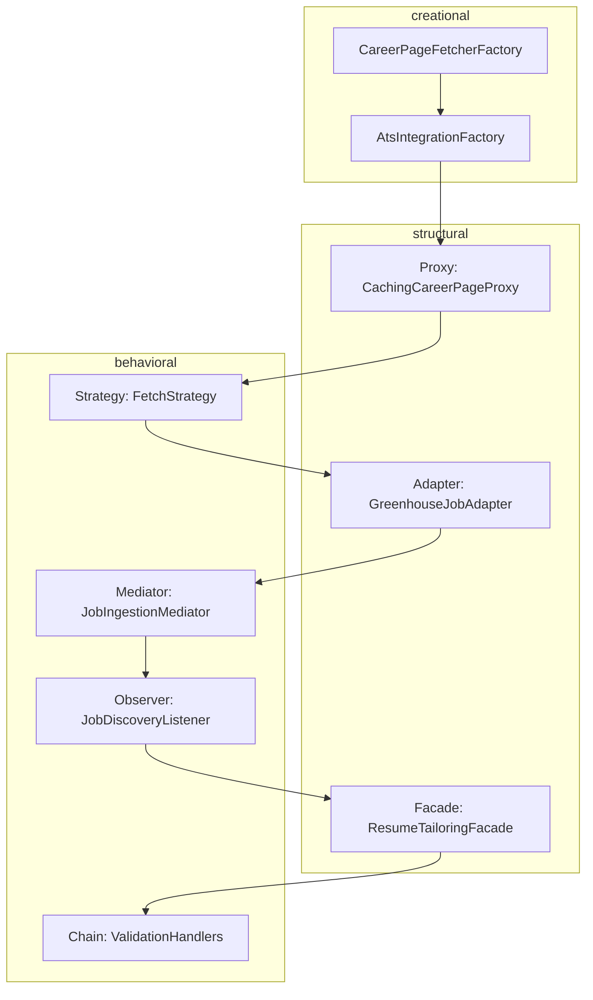

# NextOffer — Design Pattern Catalog

Course requirement: **≥ 3 creational**, **≥ 6 structural**, **≥ 9 behavioral**.

This document maps each pattern to a **real subsystem** in NextOffer (career observers, resume tailoring, PDF generation). Code is organized by **feature module** (not pattern name); patterns are documented in class Javadoc.

### Package layout

| Module | Package | Responsibility |
|--------|---------|----------------|
| Career | `com.example.nextoffer.career` | Fetch jobs from ATS/career pages (Factory, Strategy, Adapter, Proxy, …) |
| Watch | `com.example.nextoffer.watch` | Company watch list, polling, new-job notifications (Observer, Mediator) |
| Job | `com.example.nextoffer.job` | Job DTOs and display decorators |
| Resume | `com.example.nextoffer.resume` | Tailoring, validation, LaTeX/PDF, versions (Builder, Chain, Facade, …) |
| Tracker | `com.example.nextoffer.tracker` | Application status workflow (State) |

## Pattern counts

| Category    | Required | Implemented in codebase |
|-------------|----------|-------------------------|
| Creational  | 3        | **4**                   |
| Structural  | 6        | **7**                   |
| Behavioral  | 9        | **11**                  |

---

## Creational (4)

| Pattern | Class(es) | Role in NextOffer |
|---------|-----------|-------------------|
| **Factory Method** | `career.CareerPageFetcherFactory` | Subclasses decide which `CareerPageFetcher` to create per ATS type (Greenhouse, Lever, custom HTML). |
| **Abstract Factory** | `career.AtsIntegrationFactory`, `career.GreenhouseIntegrationFactory` | Creates a *family* of related objects: fetcher + parser + normalizer for one ATS vendor. |
| **Builder** | `resume.TailoredResumeBuilder` | Step-by-step construction of a tailored resume (sections, bullets, keywords) before LaTeX merge. |
| **Prototype** | `resume.ResumeTemplatePrototype` | Clone a base LaTeX/content template for each new job instead of rebuilding from scratch. |

---

## Structural (7)

| Pattern | Class(es) | Role in NextOffer |
|---------|-----------|-------------------|
| **Adapter** | `career.GreenhouseJobAdapter` | Converts external Greenhouse JSON into internal `job.JobPostingDto`. |
| **Bridge** | `resume.ResumeRenderer`, `resume.LatexResumeRenderer` | Separates resume *content* from *rendering* (LaTeX today, other backends later). |
| **Composite** | `resume.ResumeSectionComponent`, `resume.ResumeSectionLeaf` | Tree of resume sections (Experience → roles → bullets) for traversal and export. |
| **Decorator** | `job.JobPostingDecorator`, `job.MatchScoreJobDecorator` | Adds match score / highlights to a job without changing core `JobPostingDto`. |
| **Facade** | `resume.ResumeTailoringFacade` | Single entry: “tailor resume for job X” hiding AI, validation, LaTeX, and storage. |
| **Flyweight** | `career.CompanyBrandingFlyweightFactory` | Shares immutable company name/logo metadata across many job cards. |
| **Proxy** | `career.CachingCareerPageProxy` | Lazy/cached fetch of career pages to respect rate limits and reduce load. |

---

## Behavioral (11)

| Pattern | Class(es) | Role in NextOffer |
|---------|-----------|-------------------|
| **Observer** | `watch.CompanyWatchSubject`, `watch.JobDiscoveryListener` | Watch list notifies dashboard pipeline when a **new** job is detected. |
| **Strategy** | `career.CareerPageFetchStrategy`, `career.GreenhouseFetchStrategy` | Interchangeable algorithms for fetching jobs per company/site. |
| **State** | `tracker.ApplicationTrackerContext`, `tracker.NewApplicationState`, … | Application lifecycle: NEW → VIEWED → APPLIED → REJECTED. |
| **Command** | `resume.TailorResumeCommand`, `resume.CommandInvoker` | Queues/replays tailor-resume actions; supports undo of in-memory edits. |
| **Chain of Responsibility** | `resume.ResumeValidationHandler`, `resume.NoFabricationValidationHandler` | Ordered checks: no false experience, required sections, ATS length limits. |
| **Template Method** | `resume.AbstractTailoringPipeline` | Fixed pipeline steps; subclasses plug in OpenAI vs rule-based tailoring. |
| **Memento** | `resume.ResumeVersionMemento`, `resume.ResumeHistoryCaretaker` | Stores/restores prior tailored resume snapshots for version management. |
| **Mediator** | `watch.JobIngestionMediator` | Coordinates fetcher, diff detector, repository, and listeners without tight coupling. |
| **Iterator** | `resume.ResumeSectionIterator` | Walks composite resume tree for rendering and export. |
| **Visitor** | `resume.ResumeSectionVisitor`, `resume.LatexExportVisitor` | Operations on sections (export to LaTeX, word count) without bloating section classes. |
| **Null Object** | `resume.NullResumeSection` | Safe no-op section when user has no entries for a category (avoids null checks). |

---

## How patterns connect (observer flow)

---

## Spring Boot vs custom patterns

Spring uses **Singleton**, **Proxy** (AOP), **Template Method** (`JdbcTemplate`), etc. For grading, cite the **custom classes above** (`career`, `watch`, `job`, `resume`, `tracker`) in your report and point to this file. Do not count framework internals as your project patterns unless the rubric allows it.

---

## Frontend (React) — optional secondary mapping

If the rubric includes the UI layer, map patterns in documentation only (e.g. **Observer** → React context + subscriptions, **Composite** → nested dashboard widgets). Primary implementations remain in Java for this catalog.

---

## Implementation checklist

- [x] Wire `JobPollingScheduler` to `JobIngestionMediator` + fetch strategies
- [x] Persist `CompanyWatch`, `JobPosting` via JPA (+ REST APIs)
- [x] Persist `TailoredResume` via JPA (+ resume REST APIs)
- [x] Connect `ResumeTailoringFacade` to OpenAI/OpenRouter client (rule-based fallback)
- [x] Run LaTeX/PDF via `PdfCompileService` (local + Docker on Render)
- [x] Resume generation goes through `ResumeTailoringFacade` (controllers → `ResumeService` → facade)
